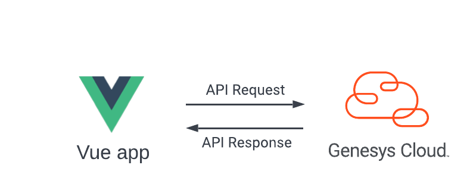

# Develop a Vue App for basic agent monitoring

View the [Develop a Vue App for basic agent monitoring blueprint](https://developer.mypurecloud.com/blueprints/agent-monitoring-app-blueprint "Opens the Genesys Cloud Developer Center blueprints page").



This Genesys Cloud Developer Blueprint demonstrates how to include the Genesys Cloud Platform API Client SDK - JavaScript in a Vue project. This solution includes a sample Vue project that allows supervisors to monitor the agents' statuses.

## Sample Vue app

This solution includes a sample Vue app that uses the Genesys Cloud Platform API Client SDK - JavaScript to display the user and routing status of queue members.

[Sample Vue app](https://genesyscloudblueprints.github.io/agent-monitoring-app-blueprint/ "Opens the sample Vue app")

To authenticate in a Genesys Cloud region other than mypurecloud.com, add an `environment` query parameter.

For example:

```
https://genesyscloudblueprints.github.io/agent-monitoring-app-blueprint/?environment=mypurecloud.ie
```
You can view the complete blueprint and download the sample app files from [here](https://github.com/GenesysCloudBlueprints/agent-monitoring-app-blueprint/tree/main/agent-monitoring-app "Opens the sample Vue app").


