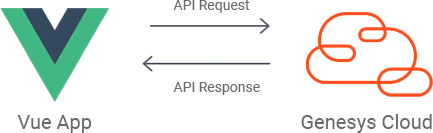

# Develop a Vue App that provides basic agent monitoring functionality

View the full [Develop a Vue App that provides basic agent monitoring functionality](https://developer.mypurecloud.com/blueprints/agent-monitoring-app) article on the Genesys Cloud Developer Center.



This Genesys Cloud Developer Blueprint demonstrates how to to include the Genesys Cloud Javascript Platform SDK in a Vue project. The blueprint includes a sample Vue project that uses the Genesys Cloud API for basic supervisor functionality of monitoring agent statuses.

## Sample Vue app

This solution includes a sample Vue app that uses the Genesys Cloud Javascript Platform SDK to display the user and routing status of queue members.

[Sample Vue app](https://genesyscloudblueprints.github.io/agent-monitoring-app "Goes to the sample Vue app")

To authenticate in a Genesys Cloud region other than `mypurecloud.com`, add an `environment` query parameter.

For example:

```
https://genesyscloudblueprints.github.io/agent-monitoring-app?environment=mypurecloud.ie
```

For more details, see the  [Develop a Vue App that provides basic agent monitoring functionality](https://developer.mypurecloud.com/blueprints/agent-monitoring-app "Goes to the blueprint article")
