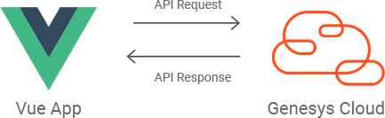

This Genesys Cloud Developer Blueprint demonstrates how to to include the Genesys Cloud Javascript Platform SDK in a Vue project. The blueprint includes a sample Vue project that uses the Genesys Cloud API for basic supervisor functionality of monitoring agent statuses.



## Contents

* [Solution components](#solution-components "Goes to the Solutions Components section")
* [Prerequisites](#prerequisites "Goes to the Prerequisites section")
* [Sample Vue app](#sample-vue-app "Goes to the Sample Vue app section")
* [Implementation steps](#implementation-steps "Goes to the Implementation steps section")
* [Additional resources](#additional-resources "Goes to the Additional resources section")

## Solution components

* **Genesys Cloud** - A suite of Genesys cloud services for enterprise-grade communications, collaboration, and contact center management. In this solution, a Genesys Cloud user account is required in order for the Vue app to be authorized to integrate with Genesys Cloud.
* **Vue CLI** - A command line tool that facilitates standard tooling for Vue projects.

### Software development kit (SDK)

* **Genesys Cloud Platfrom API SDK** -  Client libraries used to simplify application integration with Genesys Cloud by handling low-level HTTP requests. In this solution, the SDK authorizes the user and performs the API calls required to execute the supervisor features.

## Prerequisites

### Specialized knowledge

* Administrator-level knowledge of Genesys Cloud
* Experience using the Genesys Cloud Platform API
* Experience using Vue or Vue CLI 

### Genesys Cloud account requirements

* A Genesys Cloud license. For more information on licensing, see [Genesys Cloud Pricing](https://www.genesys.com/pricing "Goes to the pricing page").
* (Recommended) The Master Admin role in Genesys Cloud. For more information, see [Roles and permissions overview](https://help.mypurecloud.com/?p=24360 "Opens the Roles and permissions overview article") in the Genesys Cloud Resource Center.

## Sample Vue app  

This solution includes a sample Vue app that uses the Genesys Cloud Javascript Platform SDK to list the agents of a chosen queue. The page will show their user status and routing status, and will update accordingly as they change. 

If a user goes "Not Responding" on an incoming interaction, then a browser alert will trigger, notifying the app user.

:::primary
For maximum compatibility, this project is made with Vue CLI (Vue v2). If you are using this as a reference for your existing Vue project, there may be some slight differences in project structure and configuration.
:::


### Genesys Cloud service

In Vue there's no standard way of creating 'services'. In this sample Vue app, a script file `./src/services/genesyscloud-service.ts` is available and contains all  Genesys Cloud-related functionality.

### Run the sample Vue app

You can run the sample Vue app locally or from the blueprint repo.

:::primary
**Note**: Regardless of where you run the sample Vue app from, you need a Genesys Cloud user account in order for it to work.
:::

To run the sample Vue app from the blueprint repo:

1. Click [here](https://genesyscloudblueprints.github.io/agent-monitoring-app/ "Goes to the sample Vue app").

2. If you're on a different region than `us-east-1` (mypurecloud.com), add an `environment` query parameter to the URL and enter your Genesys Cloud environment.

  For example:

  ```bash
  https://genesyscloudblueprints.github.io/agent-monitoring-app/?environment=mypurecloud.com.au
  ```

  For more information, see [Platform API](/api/rest/ "Goes to the Platform API page in the Genesys Cloud Developer Center").

### Running the app locally

1. Clone the [blueprint repo](https://github.com/GenesysCloudBlueprints/agent-monitoring-app "Goes to the blueprint repo in Github") to your local machine:

    ```bash
    git clone https://github.com/GenesysCloudBlueprints/agent-monitoring-app.git
    ```

2. Go to the **agent-monitoring-app** project directory.

    ```bash
    cd genesys-cloud-sample
    ```

3. Modify the client ID and redirect URI values in the config files.

    i. Go to the **src**>**config** directory.

    ii. Modify the production `config.ts` file:

    ```typescript
    export default {
            clientId: '<YOUR CLIENT ID HERE>',
            redirectUri: '<YOUR HOSTED PAGE URL HERE>'
    }
    ```

## Implementation steps

The following instructions will show how to create a new Vue project using Vue CLI and shows additional configuration to make it work with the Genesys Cloud Platform Client SDK.

### Create a Token Implicit Grant (Browser) client in Genesys Cloud

1. To authorize your app with the Genesys Cloud SDK, create an Implicit Grant (Browser) client with the following settings:

    * **Authorized redirect URIs (one per line)**:
       * Your production URI
       * `http://localhost:4200/` (to test locally)
    * **Scope**:
       * analytics
       * authorization
       * presence
       * routing
       * users

For more information, see [Create an OAuth client](https://help.mypurecloud.com/articles/create-an-oauth-client/ "Goes to the Create an OAuth client article") in the Genesys Cloud Resource Center.

### Prepare Vue

1. Install the Vue CLI if it's not yet available:

    ```bash
    npm install -g @vue/cli
    # OR
    yarn global add @vue/cli
    ```

2. Follow the prompts for configuring your project. You may use either Vue 2 or Vue 3.

3. Create a new Vue project:

    ```bash
    vue create name-of-your-app
    ```

4. Go in the project directory.

    ```bash
    cd name-of-your-app
    ```

### Install NPM packages

1. Install the Genesys Cloud platform client:

    ```bash
    npm install purecloud-platform-client-v2
    ```

2. Create a Vue config file `vue.config.js` in the project directory. Add the following configuration to the file:

    ```javascript
    configureWebpack: {
        module.exports = {
        configureWebpack: {
            resolve: {
                mainFields: ['jsnext:main', 'browser', 'module', 'main']
            }
        }
    }
    ```

    This will allow the `purecloud-platform-client-v2` library to be successfully imported through webpack.

### Import the Genesys Cloud Javascript Platform SDK into your Vue project

1. Import and use the Genesys Cloud platform client in your Vue code. For example:

    ```typescript
    import platformClient from 'purecloud-platform-client-v2'
    import config from '@/config/config'

    // Login to Genesys Cloud
    async loginImplicitGrant (): Promise<void> {
        const client = platformClient.ApiClient.instance
        await client.loginImplicitGrant(config.clientId, config.redirectUri)
    }
    ```

## Additional resources

* [Genesys Cloud Platform SDK - Javascript](/api/rest/client-libraries/javascript/ "Goes to the Platform API Javascript Client page")
* [Sample Vue App](https://genesyscloudblueprints.github.io/agent-monitoring-app "Goes to the sample Vue app")
* [Vue CLI Homepage](https://cli.vuejs.org/ "Goes to the Vue CLI website")
* [Vue.js Homepage](https://vuejs.org/ "Goes to the Vue website")
