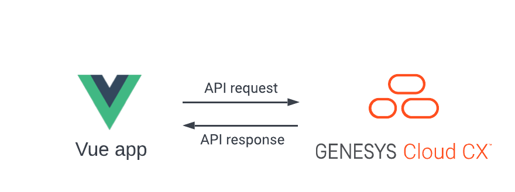

This Genesys Cloud Developer Blueprint demonstrates how to include the Genesys Cloud Platform API Client SDK - JavaScript in a Vue project. This solution includes a sample Vue project that allows supervisors to monitor the agents' statuses.



## Solution components

* **Genesys Cloud** - A suite of Genesys cloud services for enterprise-grade communications, collaboration, and contact center management. In this solution, you require a Genesys Cloud user account to authorize the Vue app integration with Genesys Cloud.
* **Vue CLI** - A command line tool that facilitates standard tooling for Vue projects.

### Software development kit (SDK)

* **Genesys Cloud Platform API SDK** -  Client libraries handle the low-level HTTP requests and simplify the application integration with Genesys Cloud. In this solution, the JavaScript SDK authorizes the user and performs the API calls required to execute the supervisor features.
  
## Prerequisites

### Specialized knowledge

* Administrator-level knowledge of Genesys Cloud
* Experience using the Genesys Cloud Platform API and the Genesys Cloud Platform API Client SDK - JavaScript
* Experience using Vue or Vue CLI 

### Genesys Cloud account requirements

* A Genesys Cloud license. For more information, see [Genesys Cloud Pricing](https://www.genesys.com/pricing "Opens the Genesys Cloud pricing page").
* Master Admin role in Genesys Cloud. For more information, see [Roles and permissions overview](https://help.mypurecloud.com/?p=24360 "Opens the Roles and permissions overview article") in the Genesys Cloud Resource Center.

## Sample Vue app  

The blueprint includes a sample Vue app that uses the Genesys Cloud Platform API Client SDK - JavaScript to list the agents of a selected queue. For each agent, the app shows the agent's current status and routing status. If an agent status changes to "Not Responding" for an incoming interaction, then the browser triggers an alert and notifies the user of the sample app.

:::primary
The Vue project is created using the Vue CLI (Vue version 2) for maximum compatibility. If you are using this as a reference for your existing Vue project, there can be differences in project structure and configuration.
:::


### Genesys Cloud service

In the sample Vue app, the script file `./src/services/genesyscloud-service.ts` contains all the Genesys Cloud-related functionality.

### Run the sample Vue app

You can run the sample Vue app locally or from the GitHub repo.

:::primary
**Note**: A Genesys Cloud user account is mandatory for the app to work regardless from where you run the Vue app.
:::

To run the sample Vue app from the GitHub repo:

1. Use the link [https://genesyscloudblueprints.github.io/agent-monitoring-app-blueprint/](https://genesyscloudblueprints.github.io/agent-monitoring-app-blueprint/ "Opens the sample Vue app") to open the app.
2. If you're in a different region other than us-east-1 (mypurecloud.com), add an `environment` query parameter to the URL and enter your Genesys Cloud environment.

    For example:

    ```bash
    https://genesyscloudblueprints.github.io/agent-monitoring-app-blueprint/?environment=mypurecloud.com.au
    ```

  For more information, see [Platform API](/api/rest/ "Opens the Platform API page").

### Run the app locally

1. Clone the GitHub repository [agent-monitoring-app](https://github.com/GenesysCloudBlueprints/agent-monitoring-app-blueprint "Opens the GitHub repository") to your local machine:

    ```bash
    git clone https://github.com/GenesysCloudBlueprints/agent-monitoring-app-blueprint.git
    ```

2. Navigate to the **agent-monitoring-app** project directory:

    ```bash
    cd genesys-cloud-sample
    ```

3. Modify the client ID and redirect URI values in the config file:

    * Open and modify the production [config.ts](/agent-monitoring-app/src/config/ "Opens the config.ts file") file:

        ```typescript
        export default {
            clientId: '<YOUR CLIENT ID HERE>',
            redirectUri: '<YOUR HOSTED PAGE URL HERE>'
        }
        ```

4. Serve the web app locally:

    ```bash
    npm run serve
    ```

  :::primary
  **Note**: To serve the web app, you must have [Vue CLI](https://cli.vuejs.org/ "Vue CLI home page") installed on your local machine.
  :::
  
## Implementation steps

The following instructions describe how to create a new Vue project using the Vue CLI and the additional configuration that is required to work with the Genesys Cloud Platform API Client SDK - JavaScript.

### Create a Token Implicit Grant (Browser) OAuth client in Genesys Cloud

1. To authorize your Vue app with the Genesys Cloud SDK, create a Token Implicit Grant (Browser) OAuth client with the following settings:

    * **Grant type**: Token Implicit Grant (Browser)
    * **Authorized redirect URIs (one per line)**:
       * Your production URI
       * `http://localhost:4200/` (to test locally)
    * **Scope**:
       * analytics
       * authorization
       * presence
       * routing
       * users
2. Note the client ID for later use to configure your project.

For more information, see [Create an OAuth client](https://help.mypurecloud.com/articles/create-an-oauth-client/ "Opens the Create an OAuth client article") in the Genesys Cloud Resource Center.

### Prepare Vue

1. Install the Vue CLI version 2 or later:

    ```bash
    npm install -g @vue/cli
    ```
    or
    ```bash
    yarn global add @vue/cli
    ```

2. Create a new Vue project and follow the prompts to configure the project:

    ```bash
    vue create name-of-your-app
    ```

3. Change to the project directory:

    ```bash
    cd name-of-your-app
    ```

### Install npm packages

1. Install the Genesys Cloud API Platform client package:

    ```bash
    npm install purecloud-platform-client-v2
    ```

2. Create a `vue.config.js` configuration file in the project directory. Add the following configuration to the file:

    ```javascript
    configureWebpack: {
        module.exports = {
        configureWebpack: {
            resolve: {
                mainFields: ['jsnext:main', 'browser', 'module', 'main']
            }
        }
    }
    ```
    This configuration allows the `purecloud-platform-client-v2` library to be successfully imported through webpack.

### Import the Genesys Cloud Platform API Client SDK - JavaScript into your Vue project

1. Import and use the Genesys Cloud Platform API Client SDK - JavaScript into your Vue project. For example:

    ```typescript
    import platformClient from 'purecloud-platform-client-v2'
    import config from '@/config/config'
    ```
2. Use the different API tools that are available in the `platformClient` object:
   
    ```typescript
    // Log in to Genesys Cloud
    async loginImplicitGrant (): Promise<void> {
        const client = platformClient.ApiClient.instance
        await client.loginImplicitGrant(config.clientId, config.redirectUri)
    }
    ```

## Additional resources

* [Genesys Cloud Platform API Client SDK - JavaScript](/api/rest/client-libraries/javascript/ "Opens the Platform API JavaScript Client page") in the Genesys Cloud Developer Center
* [Sample Vue App](https://genesyscloudblueprints.github.io/agent-monitoring-app-blueprint/ "Opens the sample Vue app") in GitHub
* [Vue CLI home page](https://cli.vuejs.org/ "Opens the Vue CLI website") in the Vue CLI website
* [Vue.js home page](https://vuejs.org/ "Opens the Vue website") in the Vue website
